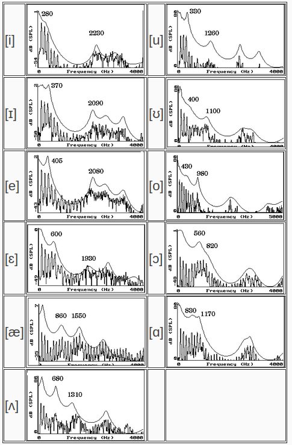

# wav to lip

lip sync using vowel phonetic detection 

## formant
For the purposes of distinguishing vowels from each other, we are more interested in the frequency
response curves (indicating the preferred resonating frequencies of the vocal tract) rather than in
the raw spectrum of the wave.

Each of the preferred resonanting frequencies of the vocal tract (each bump in the frequency response
curve) is known as a formant . They are usually referred to as F1, F2, F3, etc.

for formant we use [praat-parselmouth](https://parselmouth.readthedocs.io/en/stable/) package

### distinguishing vowels from each other

based on following image form [umanitoba.ca](https://home.cc.umanitoba.ca/~krussll/phonetics/acoustic/formants.html) 
we recognize vowel in audio




# RUN

install requirements
```python
pip install -r requirements.txt
```

change audio path in main.py
```python
python main.py
```
